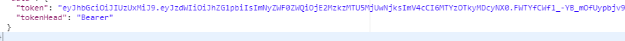
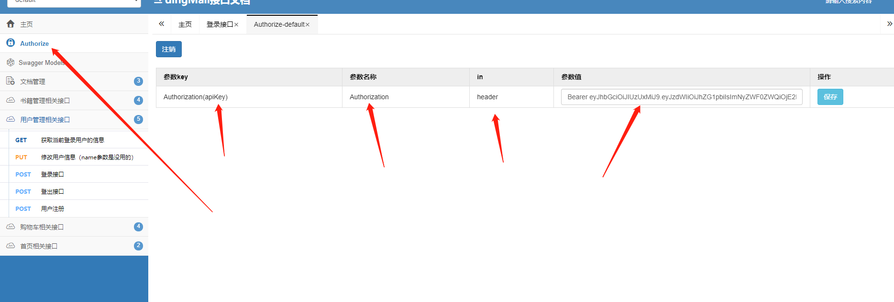
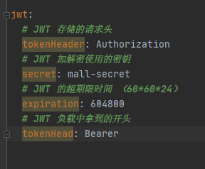
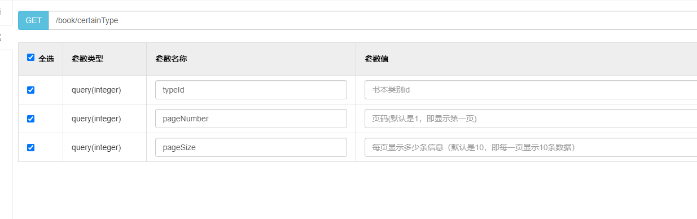

# 		                    接口文档使用说明 

1. **登录**

   用户名 admin

   密码 123

  登录后会返回jwt令牌

  包含  token和token的头

 

2. **配置Authorize 模拟每次请求的header**

其中参数值为  ：    Bearer+空格+token

后台设置：

3. 注意事项

   

类似上图，勾了参数就一定要填

因为@RequestBody和@Validation在一起使用把之前的参数校验都搞失效了

所以接口现在约等于没有参数校验
