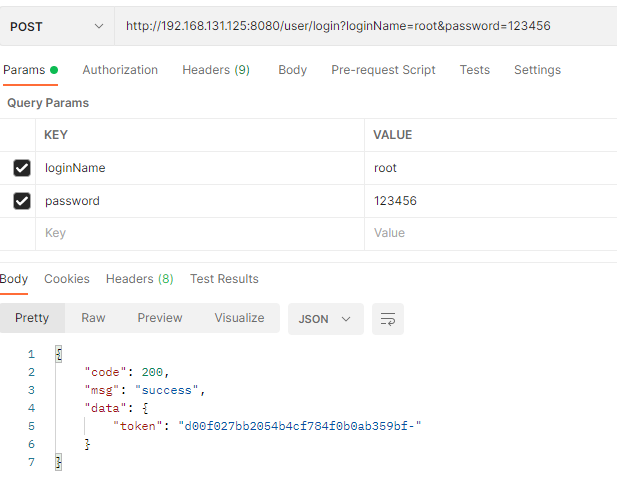
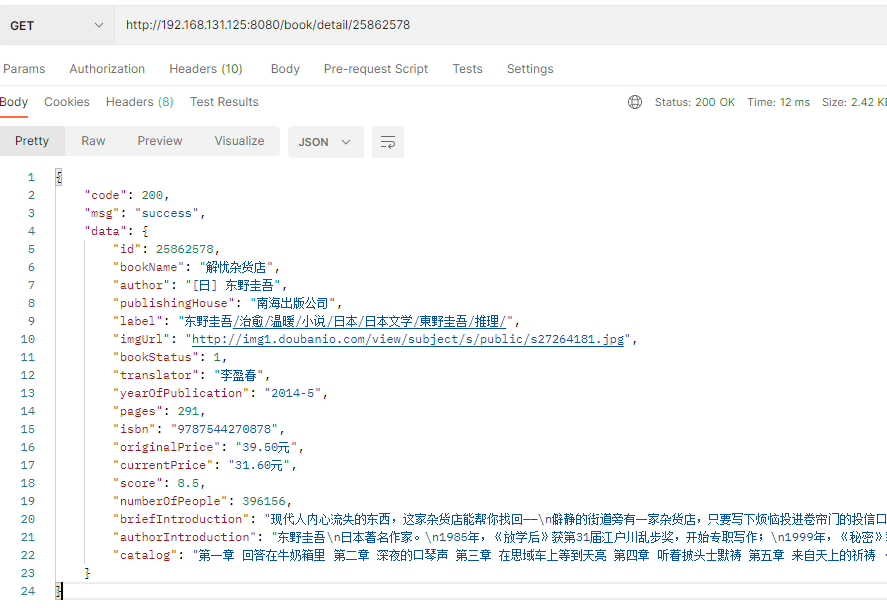

                        后台接口

（一）user用户管理相关接口

1. 登录   

   post请求

   http://192.168.131.125:8080/user/login?loginName=root&password=123456

   

​    返回 token


2. 注册

   post

http://192.168.131.125:8080/user/register?loginName=wku&password=123


3. 修改user信息

   put请求  要在header上添加 token

​       http://192.168.131.125:8080/user/info?nickName=昵称&password=123&introduceSign=个性签名


4. 获取用户信息

   get请求 要在header上添加 token

   http://192.168.131.125:8080/user/info

​       

5. 用户退出

   post 需要token

   


(二) book 书籍管理相关接口

1. 根据id获取书本详情信息（商品详情页面）

   GET   http://192.168.131.125:8080/book/detail/25862578



2. 关键词查询书本 （查询结果页面）

   GET    http://192.168.131.125:8080/book/search?label=&author=&keyword=文学&pageNumber=1&pageSize=10&orderBy=time

   参数要求：

    根据label  author  keyword 检索，这三个一定要有一个

    还可以设置pageSize页面大小和pageNumber当前页面数，不设置后台默认每页放10条数据，当前页面为1

    还可以设置 orderBy 排序规则（time or price）,默认按评分排序

   

3. 图书分类查询结果接口

   GET http://192.168.131.125:8080/book/certainType?typeId=1&pageNumber=1&pageSize=10

   参数要求：

   ​    typeId不能为空

   ​    可以选择设置  pageNumber 当前页面 &  pageSize页面大小  

   

   4. 分类标签页面接口

      GET  http://192.168.131.125:8080/book/categories

      不需要参数

      返回 

      一级标签和其对应的二级标签

      
   
   

(三) 首页接口

1. 首页顶部导航接口

GET http://localhost:8080/index/nav

不需要参数

得到6个一级标签name及其id


2. 轮播图接口

```

```
